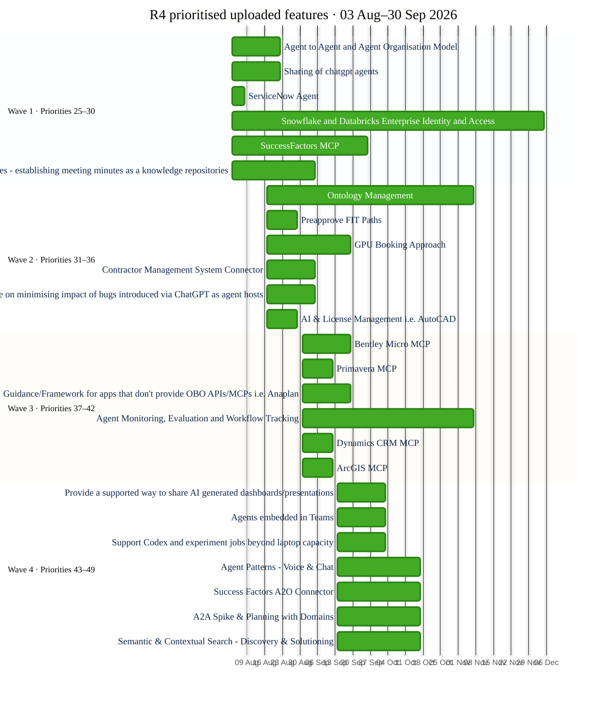

# R4 uploaded-feature delivery plan

This plan contains only the 25 activities identified by the uploaded prioritisation workbook's R4 capacity bar (priorities 25–49). No roadmap tasks or additional milestones have been added.

Planning assumptions:

- R4 begins 03 August 2026 and ends 30 September 2026.
- Activities are staggered into four priority waves.
- Duration initially equals uploaded effort points in working days because no team allocation or separate duration was supplied.
- Activities remain allocated to R4 even where their calculated finish extends beyond 30 September.
- No dependencies or owners have been invented.

## Mermaid Gantt chart



## Planner data

```json
{
  "version": 4,
  "sections": [
    {
      "name": "Wave 1 · Priorities 25–30",
      "tasks": [
        {
          "name": "Agent to Agent and Agent Organisation Model",
          "jira": "HTTPS://FMGL.ATLASSIAN.NET/BROWSE/FDAP-18150",
          "taskId": "feature-r4-14",
          "startDate": "2026-08-03",
          "durationDays": 15,
          "effortDays": 15,
          "dates": [
            "2026-08-03",
            "2026-08-21"
          ],
          "modifiers": [],
          "release": "R4",
          "owners": [],
          "dependencies": [],
          "sourcePriority": 25,
          "sourceFeatureId": "14",
          "sourceWorkflow": "discovery",
          "sourceDomains": "Corporate Services | AI-First",
          "metadata": "feature-r4-14, 2026-08-03, 2026-08-21",
          "raw": "    Agent to Agent and Agent Organisation Model :feature-r4-14, 2026-08-03, 15d"
        },
        {
          "name": "Sharing of chatgpt agents",
          "jira": "https://fmgl.atlassian.net/browse/FDAP-19689",
          "taskId": "feature-r4-117",
          "startDate": "2026-08-03",
          "durationDays": 15,
          "effortDays": 15,
          "dates": [
            "2026-08-03",
            "2026-08-21"
          ],
          "modifiers": [],
          "release": "R4",
          "owners": [],
          "dependencies": [],
          "sourcePriority": 26,
          "sourceFeatureId": "117",
          "sourceWorkflow": "",
          "sourceDomains": "Projects and R&D",
          "metadata": "feature-r4-117, 2026-08-03, 2026-08-21",
          "raw": "    Sharing of chatgpt agents :feature-r4-117, 2026-08-03, 15d"
        },
        {
          "name": "ServiceNow Agent",
          "jira": "FDAP-17833",
          "taskId": "feature-r4-40",
          "startDate": "2026-08-03",
          "durationDays": 5,
          "effortDays": 5,
          "dates": [
            "2026-08-03",
            "2026-08-07"
          ],
          "modifiers": [],
          "release": "R4",
          "owners": [],
          "dependencies": [],
          "sourcePriority": 27,
          "sourceFeatureId": "40",
          "sourceWorkflow": "discovery",
          "sourceDomains": "Projects and R&D | Corporate Services",
          "metadata": "feature-r4-40, 2026-08-03, 2026-08-07",
          "raw": "    ServiceNow Agent :feature-r4-40, 2026-08-03, 5d"
        },
        {
          "name": "Snowflake and Databricks Enterprise Identity and Access",
          "jira": "FDAP-17786",
          "taskId": "feature-r4-49",
          "startDate": "2026-08-03",
          "durationDays": 90,
          "effortDays": 90,
          "dates": [
            "2026-08-03",
            "2026-12-04"
          ],
          "modifiers": [],
          "release": "R4",
          "owners": [],
          "dependencies": [],
          "sourcePriority": 28,
          "sourceFeatureId": "49",
          "sourceWorkflow": "discovery",
          "sourceDomains": "Mine and plant intelligence | Supply Chain Planning | Site Physical | Mine Exploration and Planning | Asset Management | Projects and R&D | Corporate Services",
          "metadata": "feature-r4-49, 2026-08-03, 2026-12-04",
          "raw": "    Snowflake and Databricks Enterprise Identity and Access :feature-r4-49, 2026-08-03, 90d"
        },
        {
          "name": "SuccessFactors MCP",
          "jira": "FDAP-17830",
          "taskId": "feature-r4-45",
          "startDate": "2026-08-03",
          "durationDays": 40,
          "effortDays": 40,
          "dates": [
            "2026-08-03",
            "2026-09-25"
          ],
          "modifiers": [],
          "release": "R4",
          "owners": [],
          "dependencies": [],
          "sourcePriority": 29,
          "sourceFeatureId": "45",
          "sourceWorkflow": "discovery",
          "sourceDomains": "Supply Chain Planning | Corporate Services",
          "metadata": "feature-r4-45, 2026-08-03, 2026-09-25",
          "raw": "    SuccessFactors MCP :feature-r4-45, 2026-08-03, 40d"
        },
        {
          "name": "Meeting minutes - establishing meeting minutes as a knowledge repositories",
          "jira": "https://fmgl.atlassian.net/browse/FDAP-19688",
          "taskId": "feature-r4-116",
          "startDate": "2026-08-03",
          "durationDays": 25,
          "effortDays": 25,
          "dates": [
            "2026-08-03",
            "2026-09-04"
          ],
          "modifiers": [],
          "release": "R4",
          "owners": [],
          "dependencies": [],
          "sourcePriority": 30,
          "sourceFeatureId": "116",
          "sourceWorkflow": "",
          "sourceDomains": "Projects and R&D",
          "metadata": "feature-r4-116, 2026-08-03, 2026-09-04",
          "raw": "    Meeting minutes - establishing meeting minutes as a knowledge repositories :feature-r4-116, 2026-08-03, 25d"
        }
      ]
    },
    {
      "name": "Wave 2 · Priorities 31–36",
      "tasks": [
        {
          "name": "Ontology Management",
          "jira": "FDAP-17713",
          "taskId": "feature-r4-31",
          "startDate": "2026-08-17",
          "durationDays": 60,
          "effortDays": 60,
          "dates": [
            "2026-08-17",
            "2026-11-06"
          ],
          "modifiers": [],
          "release": "R4",
          "owners": [],
          "dependencies": [],
          "sourcePriority": 31,
          "sourceFeatureId": "31",
          "sourceWorkflow": "discovery",
          "sourceDomains": "Mine and plant intelligence | Supply Chain Planning | Projects and R&D",
          "metadata": "feature-r4-31, 2026-08-17, 2026-11-06",
          "raw": "    Ontology Management :feature-r4-31, 2026-08-17, 60d"
        },
        {
          "name": "Preapprove FIT Paths",
          "jira": "HTTPS://FMGL.ATLASSIAN.NET/BROWSE/FDAP-17804",
          "taskId": "feature-r4-36",
          "startDate": "2026-08-17",
          "durationDays": 10,
          "effortDays": 10,
          "dates": [
            "2026-08-17",
            "2026-08-28"
          ],
          "modifiers": [],
          "release": "R4",
          "owners": [],
          "dependencies": [],
          "sourcePriority": 32,
          "sourceFeatureId": "36",
          "sourceWorkflow": "discovery",
          "sourceDomains": "Projects and R&D",
          "metadata": "feature-r4-36, 2026-08-17, 2026-08-28",
          "raw": "    Preapprove FIT Paths :feature-r4-36, 2026-08-17, 10d"
        },
        {
          "name": "GPU Booking Approach",
          "jira": "HTTPS://FMGL.ATLASSIAN.NET/BROWSE/FDAP-19667",
          "taskId": "feature-r4-109",
          "startDate": "2026-08-17",
          "durationDays": 25,
          "effortDays": 25,
          "dates": [
            "2026-08-17",
            "2026-09-18"
          ],
          "modifiers": [],
          "release": "R4",
          "owners": [],
          "dependencies": [],
          "sourcePriority": 33,
          "sourceFeatureId": "109",
          "sourceWorkflow": "",
          "sourceDomains": "Supply Chain Planning",
          "metadata": "feature-r4-109, 2026-08-17, 2026-09-18",
          "raw": "    GPU Booking Approach :feature-r4-109, 2026-08-17, 25d"
        },
        {
          "name": "Contractor Management System Connector",
          "jira": "FDAP-17844",
          "taskId": "feature-r4-22",
          "startDate": "2026-08-17",
          "durationDays": 15,
          "effortDays": 15,
          "dates": [
            "2026-08-17",
            "2026-09-04"
          ],
          "modifiers": [],
          "release": "R4",
          "owners": [],
          "dependencies": [],
          "sourcePriority": 34,
          "sourceFeatureId": "22",
          "sourceWorkflow": "discovery",
          "sourceDomains": "Projects and R&D | Corporate Services",
          "metadata": "feature-r4-22, 2026-08-17, 2026-09-04",
          "raw": "    Contractor Management System Connector :feature-r4-22, 2026-08-17, 15d"
        },
        {
          "name": "Platform approach/guidance on minimising impact of bugs introduced via ChatGPT as agent hosts",
          "jira": "https://fmgl.atlassian.net/browse/FDAP-19687",
          "taskId": "feature-r4-115",
          "startDate": "2026-08-17",
          "durationDays": 15,
          "effortDays": 15,
          "dates": [
            "2026-08-17",
            "2026-09-04"
          ],
          "modifiers": [],
          "release": "R4",
          "owners": [],
          "dependencies": [],
          "sourcePriority": 35,
          "sourceFeatureId": "115",
          "sourceWorkflow": "",
          "sourceDomains": "Projects and R&D",
          "metadata": "feature-r4-115, 2026-08-17, 2026-09-04",
          "raw": "    Platform approach/guidance on minimising impact of bugs introduced via ChatGPT as agent hosts :feature-r4-115, 2026-08-17, 15d"
        },
        {
          "name": "AI & License Management i.e. AutoCAD",
          "jira": "https://fmgl.atlassian.net/browse/FDAP-19686",
          "taskId": "feature-r4-114",
          "startDate": "2026-08-17",
          "durationDays": 10,
          "effortDays": 10,
          "dates": [
            "2026-08-17",
            "2026-08-28"
          ],
          "modifiers": [],
          "release": "R4",
          "owners": [],
          "dependencies": [],
          "sourcePriority": 36,
          "sourceFeatureId": "114",
          "sourceWorkflow": "",
          "sourceDomains": "Projects and R&D",
          "metadata": "feature-r4-114, 2026-08-17, 2026-08-28",
          "raw": "    AI & License Management i.e. AutoCAD :feature-r4-114, 2026-08-17, 10d"
        }
      ]
    },
    {
      "name": "Wave 3 · Priorities 37–42",
      "tasks": [
        {
          "name": "Bentley Micro MCP",
          "jira": "https://fmgl.atlassian.net/browse/FDAP-19684",
          "taskId": "feature-r4-113",
          "startDate": "2026-08-31",
          "durationDays": 15,
          "effortDays": 15,
          "dates": [
            "2026-08-31",
            "2026-09-18"
          ],
          "modifiers": [],
          "release": "R4",
          "owners": [],
          "dependencies": [],
          "sourcePriority": 37,
          "sourceFeatureId": "113",
          "sourceWorkflow": "",
          "sourceDomains": "Projects and R&D",
          "metadata": "feature-r4-113, 2026-08-31, 2026-09-18",
          "raw": "    Bentley Micro MCP :feature-r4-113, 2026-08-31, 15d"
        },
        {
          "name": "Primavera MCP",
          "jira": "https://fmgl.atlassian.net/browse/FDAP-19677",
          "taskId": "feature-r4-112",
          "startDate": "2026-08-31",
          "durationDays": 10,
          "effortDays": 10,
          "dates": [
            "2026-08-31",
            "2026-09-11"
          ],
          "modifiers": [],
          "release": "R4",
          "owners": [],
          "dependencies": [],
          "sourcePriority": 38,
          "sourceFeatureId": "112",
          "sourceWorkflow": "",
          "sourceDomains": "Projects and R&D",
          "metadata": "feature-r4-112, 2026-08-31, 2026-09-11",
          "raw": "    Primavera MCP :feature-r4-112, 2026-08-31, 10d"
        },
        {
          "name": "Guidance/Framework for apps that don't provide OBO APIs/MCPs i.e. Anaplan",
          "jira": "https://fmgl.atlassian.net/browse/FDAP-19679",
          "taskId": "feature-r4-111",
          "startDate": "2026-08-31",
          "durationDays": 15,
          "effortDays": 15,
          "dates": [
            "2026-08-31",
            "2026-09-18"
          ],
          "modifiers": [],
          "release": "R4",
          "owners": [],
          "dependencies": [],
          "sourcePriority": 39,
          "sourceFeatureId": "111",
          "sourceWorkflow": "",
          "sourceDomains": "Projects and R&D",
          "metadata": "feature-r4-111, 2026-08-31, 2026-09-18",
          "raw": "    Guidance/Framework for apps that don't provide OBO APIs/MCPs i.e. Anaplan :feature-r4-111, 2026-08-31, 15d"
        },
        {
          "name": "Agent Monitoring, Evaluation and Workflow Tracking",
          "jira": "FDAP-17795 / FDAP-17796",
          "taskId": "feature-r4-28",
          "startDate": "2026-08-31",
          "durationDays": 50,
          "effortDays": 50,
          "dates": [
            "2026-08-31",
            "2026-11-06"
          ],
          "modifiers": [],
          "release": "R4",
          "owners": [],
          "dependencies": [],
          "sourcePriority": 40,
          "sourceFeatureId": "28",
          "sourceWorkflow": "scoped",
          "sourceDomains": "Corporate Services",
          "metadata": "feature-r4-28, 2026-08-31, 2026-11-06",
          "raw": "    Agent Monitoring, Evaluation and Workflow Tracking :feature-r4-28, 2026-08-31, 50d"
        },
        {
          "name": "Dynamics CRM MCP",
          "jira": "https://fmgl.atlassian.net/browse/FDAP-19678",
          "taskId": "feature-r4-118",
          "startDate": "2026-08-31",
          "durationDays": 10,
          "effortDays": 10,
          "dates": [
            "2026-08-31",
            "2026-09-11"
          ],
          "modifiers": [],
          "release": "R4",
          "owners": [],
          "dependencies": [],
          "sourcePriority": 41,
          "sourceFeatureId": "118",
          "sourceWorkflow": "",
          "sourceDomains": "Projects and R&D",
          "metadata": "feature-r4-118, 2026-08-31, 2026-09-11",
          "raw": "    Dynamics CRM MCP :feature-r4-118, 2026-08-31, 10d"
        },
        {
          "name": "ArcGIS MCP",
          "jira": "https://fmgl.atlassian.net/browse/FDAP-19680",
          "taskId": "feature-r4-110",
          "startDate": "2026-08-31",
          "durationDays": 10,
          "effortDays": 10,
          "dates": [
            "2026-08-31",
            "2026-09-11"
          ],
          "modifiers": [],
          "release": "R4",
          "owners": [],
          "dependencies": [],
          "sourcePriority": 42,
          "sourceFeatureId": "110",
          "sourceWorkflow": "",
          "sourceDomains": "Projects and R&D",
          "metadata": "feature-r4-110, 2026-08-31, 2026-09-11",
          "raw": "    ArcGIS MCP :feature-r4-110, 2026-08-31, 10d"
        }
      ]
    },
    {
      "name": "Wave 4 · Priorities 43–49",
      "tasks": [
        {
          "name": "Provide a supported way to share AI generated dashboards/presentations",
          "jira": "https://fmgl.atlassian.net/browse/FDAP-19966",
          "taskId": "feature-r4-120",
          "startDate": "2026-09-14",
          "durationDays": 15,
          "effortDays": 15,
          "dates": [
            "2026-09-14",
            "2026-10-02"
          ],
          "modifiers": [],
          "release": "R4",
          "owners": [],
          "dependencies": [],
          "sourcePriority": 43,
          "sourceFeatureId": "120",
          "sourceWorkflow": "",
          "sourceDomains": "Mine Exploration and Planning",
          "metadata": "feature-r4-120, 2026-09-14, 2026-10-02",
          "raw": "    Provide a supported way to share AI generated dashboards/presentations :feature-r4-120, 2026-09-14, 15d"
        },
        {
          "name": "Agents embedded in Teams",
          "jira": "https://fmgl.atlassian.net/browse/FDAP-19962",
          "taskId": "feature-r4-122",
          "startDate": "2026-09-14",
          "durationDays": 15,
          "effortDays": 15,
          "dates": [
            "2026-09-14",
            "2026-10-02"
          ],
          "modifiers": [],
          "release": "R4",
          "owners": [],
          "dependencies": [],
          "sourcePriority": 44,
          "sourceFeatureId": "122",
          "sourceWorkflow": "",
          "sourceDomains": "Mine Exploration and Planning",
          "metadata": "feature-r4-122, 2026-09-14, 2026-10-02",
          "raw": "    Agents embedded in Teams :feature-r4-122, 2026-09-14, 15d"
        },
        {
          "name": "Support Codex and experiment jobs beyond laptop capacity",
          "jira": "HTTPS://FMGL.ATLASSIAN.NET/BROWSE/FDAP-19965",
          "taskId": "feature-r4-121",
          "startDate": "2026-09-14",
          "durationDays": 15,
          "effortDays": 15,
          "dates": [
            "2026-09-14",
            "2026-10-02"
          ],
          "modifiers": [],
          "release": "R4",
          "owners": [],
          "dependencies": [],
          "sourcePriority": 45,
          "sourceFeatureId": "121",
          "sourceWorkflow": "",
          "sourceDomains": "Mine Exploration and Planning",
          "metadata": "feature-r4-121, 2026-09-14, 2026-10-02",
          "raw": "    Support Codex and experiment jobs beyond laptop capacity :feature-r4-121, 2026-09-14, 15d"
        },
        {
          "name": "Agent Patterns - Voice & Chat",
          "jira": "HTTPS://FMGL.ATLASSIAN.NET/BROWSE/FDAP-20911",
          "taskId": "feature-r4-123",
          "startDate": "2026-09-14",
          "durationDays": 25,
          "effortDays": 25,
          "dates": [
            "2026-09-14",
            "2026-10-16"
          ],
          "modifiers": [],
          "release": "R4",
          "owners": [],
          "dependencies": [],
          "sourcePriority": 46,
          "sourceFeatureId": "123",
          "sourceWorkflow": "",
          "sourceDomains": "Corporate Services",
          "metadata": "feature-r4-123, 2026-09-14, 2026-10-16",
          "raw": "    Agent Patterns - Voice & Chat :feature-r4-123, 2026-09-14, 25d"
        },
        {
          "name": "Success Factors A2O Connector",
          "jira": "https://fmgl.atlassian.net/browse/FDAP-17843",
          "taskId": "feature-r4-105",
          "startDate": "2026-09-14",
          "durationDays": 25,
          "effortDays": 25,
          "dates": [
            "2026-09-14",
            "2026-10-16"
          ],
          "modifiers": [],
          "release": "R4",
          "owners": [],
          "dependencies": [],
          "sourcePriority": 47,
          "sourceFeatureId": "105",
          "sourceWorkflow": "",
          "sourceDomains": "Corporate Services | AI-First",
          "metadata": "feature-r4-105, 2026-09-14, 2026-10-16",
          "raw": "    Success Factors A2O Connector :feature-r4-105, 2026-09-14, 25d"
        },
        {
          "name": "A2A Spike & Planning with Domains",
          "jira": "HTTPS://FMGL.ATLASSIAN.NET/BROWSE/FDAP-18150",
          "taskId": "feature-r4-103",
          "startDate": "2026-09-14",
          "durationDays": 25,
          "effortDays": 25,
          "dates": [
            "2026-09-14",
            "2026-10-16"
          ],
          "modifiers": [],
          "release": "R4",
          "owners": [],
          "dependencies": [],
          "sourcePriority": 48,
          "sourceFeatureId": "103",
          "sourceWorkflow": "",
          "sourceDomains": "Corporate Services | AI-First",
          "metadata": "feature-r4-103, 2026-09-14, 2026-10-16",
          "raw": "    A2A Spike & Planning with Domains :feature-r4-103, 2026-09-14, 25d"
        },
        {
          "name": "Semantic & Contextual Search - Discovery & Solutioning",
          "jira": "https://fmgl.atlassian.net/browse/FDAP-20912",
          "taskId": "feature-r4-124",
          "startDate": "2026-09-14",
          "durationDays": 25,
          "effortDays": 25,
          "dates": [
            "2026-09-14",
            "2026-10-16"
          ],
          "modifiers": [],
          "release": "R4",
          "owners": [],
          "dependencies": [],
          "sourcePriority": 49,
          "sourceFeatureId": "124",
          "sourceWorkflow": "",
          "sourceDomains": "Corporate Services",
          "metadata": "feature-r4-124, 2026-09-14, 2026-10-16",
          "raw": "    Semantic & Contextual Search - Discovery & Solutioning :feature-r4-124, 2026-09-14, 25d"
        }
      ]
    }
  ],
  "teamMembers": [],
  "teams": []
}
```
